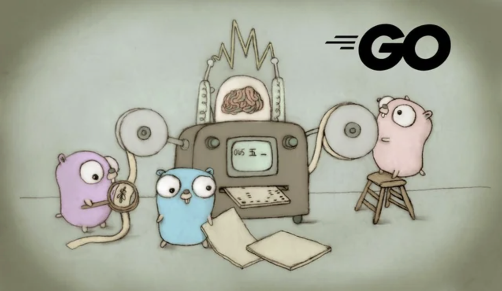

> *“I never think about memory… until production does.”*

## Why should we care?
To be honest, I haven't needed knowledge of the specifics of Go's garbage collector (GC) to significantly optimise performance in day-to-day work. 

So why should we care?

Because sometimes a hiring manager will ask:

> *"How does Go's memory management work?"*.

Jokes aside, understanding how Go manages memory can become essential when something goes wrong in production:

When you’re debugging:
- unexplained memory spikes
- latency tail issues
- high CPU usage under load
- or strange heap growth in pprof

Faced with these kinds of issues, knowing how Go manages memory becomes critical to understanding what’s happening and how to fix it.

## Manual memory
Go is a GC language like Java and Python. You don't manage memory explicitly like in C/C++ using `malloc` and `free`:
```c
int* x = malloc(sizeof(int));
free(x);
```

The tradeoff here is that manual memory control like this will give you maximum control, but with it comes maximum responsibility.

When you explicitly decide when to allocate or free memory, you dictate how long the memory lives. This means there's no GC pauses, no runtime overhead for tracking objects, more control over performance, often leading to more predictable latency when implemented carefully.

On the other hand, if memory isn't being freed properly, it can cause memory leaks or use-after-free issues. Freeing it twice causes double free, and accessing invalid memory can lead to segfault. 

## Garbage collection

In Go:
```go
x := new(int)
```

You never free memory for `x` manually. This is done by the GC.

The GC tracks object references. When it runs, it determines what is no longer reachable and frees memory automatically. 

The tradeoff here is that while the GC reduces the risks associated with manual memory management (like use-after-free, double-free, memory-corruption), there's a runtime cost. The runtime has to track objects, scan memory, and occasionally pause the program briefly to keep everything consistent.

So this is basically the core of it. Manual memory management has more risk of memory mismanagement issues but is more performant, while GC has performance costs (latency, CPU, memory). 

## Go's memory management
Like many languages, Go uses a stack and heap to manage memory. 

In Go, values that do not escape their defining function are allocated on the stack, while values that outlive the function call are allocated on the heap and managed by the garbage collector.

This is determined by escape analysis, which runs at compile time.

## Go's GC
Go’s GC uses a tri-color mark-and-sweep algorithm to determine which objects are still reachable. 

Objects are categorised into white (unseen), gray (discovered but not yet scanned), and black (fully scanned). 

The GC starts from root references and progressively marks reachable objects. 

To allow concurrent marking, Go uses write barriers. When a pointer is modified, the runtime records it to maintain GC invariants. This means pointer-heavy code slightly increases GC overhead.

That said, Go’s GC is mostly concurrent with very short stop-the-world synchronization phases.

The overall design trades a bit of CPU and memory overhead for predictable latency and simplicity, which fits nicely with Go’s focus on backend services.


## What to do with this information
One thing that matters more than total memory size is allocation rate. Reducing allocations in hot paths reduces GC pressure significantly. In practice, I focus on reducing allocations in hot paths, letting the compiler keep things on the stack by returning values over pointers in general. I also consider using pooling for expensive, reusable objects (`sync.Pool`).

Examples:

### Preallocate capacity to reduce allocations:
```go
func process(items []string) []string {
    // ❌ allocates new slice each time
    var result []string
    for _, item := range items {
        parts := strings.Split(item, ",") 
        result = append(result, parts[0])
    }
    return result
}
```

```go
func process(items []string) []string {
    // ✅ preallocate capacity
    result := make([]string, 0, len(items))
    for _, item := range items {
        parts := strings.Split(item, ",")
        result = append(result, parts[0])
    }
    return result
}
```

### Avoid unnecessary heap allocation.
We can avoid allocating to the heap by not using pointers if they are not needed.

Returning pointers often causes heap allocation because the value escapes the function, (although this depends on escape analysis):
```go
type User struct {
    Name string
}

func newUser(name string) *User {
    return &User{Name: name} // ❌ returning a pointer
}
```

Below will allocate to the stack:
```go
func newUser(name string) User {
    return User{Name: name} // ✅ return value
}
```

For making any tweaks to the GC with `GOGC`, it's a good idea to monitor with GODEBUG=gctrace=1, pprof and ReadMemStats. Only then, if the GC requires it, I tune GOGC (or debug.SetGCPercent) to trade memory for CPU. 

## In conclusion
The GC is rarely the bottleneck directly. Allocation patterns are. In Go, performance tuning usually starts with reducing allocations, not fighting the collector.

---

## Latency vs Throughput vs Memory
Stepping back a bit, every garbage collector makes tradeoffs.

### Latency
If the GC pauses your program for 200ms, your API will have 200ms latency spikes. 

This is bad for most applications, like real-time systems, APIs, games, etc. Old Java GCs are notorious for long "stop-the-world" pauses. 

### Throughput
GC consumes CPU time by marking objects, sweeping memory, maintaining write barriers. More GC work results in less CPU for your app.

### Memory
GC-managed objects live on the heap. How much extra heap you allow before triggering a collection is basically the memory overhead you’re trading for fewer collections.

You can configure the GC to collect more lazily or more aggressively with `GOGC` by setting how much extra heap you allow before collecting. 

Example:
- `GOGC=100` → collect when heap doubles
- `GOGC=200` → allow heap to grow more before collecting

Collecting more frequently (aggressively) means lower memory usage but higher CPU consumption. Lazy has the opposite problem, higher memory usage but lower CPU consumption.

---

## Further reading
- [A Guide to the Go Garbage Collector](https://go.dev/doc/gc-guide)
- [Getting to Go: The Journey of Go's Garbage Collector](https://go.dev/blog/ismmkeynote)
- [Profiling Go Programs with pprof](https://go.dev/blog/pprof)