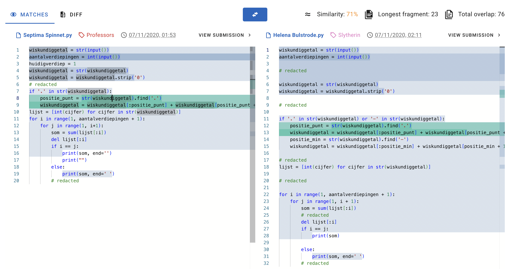

> *“Can I copy your homework?”*
>
> *"Yeah but don't make it obvious."*
> 
> *"ok."*

## Detecting plagiarism in coding tests

I used to work at a company that built a platform for conducting technical interviews. At the time, I was working on a suite of cheat detection features for LeetCode-style algorithm problems.

The premise back then (things have changed a lot since) was simple: candidates were expected to solve problems without external help. In other words, no Googling, no StackOverflow, no LeetCode discussions, no LLMs, etc.

When you run coding tests in the browser, you get access to a mildly unsettling amount of behavioural metadata. The page knows when it loses focus (like when someone switches tabs), it can observe copy/paste events, keystroke timing, idle periods. It can’t see what you’re doing in another tab, but it does notice that you suddenly stopped typing for 47 seconds and then pasted 38 lines of perfectly formatted dynamic programming.

The most interesting aspect wasn't so much about behavioural signals, but it was about **how to detect whether someone looked up a solution online and submitted it as their own**.

Naive text matching works to a point, but candidates can rename variables, translate a solution from Java to Python, or tweak formatting just enough to trick these kinds of matches.

So our solution needed to be a little bit more robust.

## Measuring code similarity with *Dolos*
The tool we picked was [Dolos](https://dolos.ugent.be/). It's an open-source code plagiarism detection system. 



It was much cheaper and simpler than building an ML system. More importantly, it was *explainable*. It produced useful metadata like matching code fragments with exact locations, along with a similarity score reliable enough to confidently flag copied solutions. 

The way Dolos measures similarity is both clever and very practical for production systems (and by extension, the feature I was building), so I spent some time digging into how it actually works under the hood.

## How it works

At a high level, Dolos converts source code into a set of compact fingerprints and then compares those fingerprints across submissions. Two files that share many fingerprints are likely from the same source.

This process has five steps:

**Tokenise → Build k-grams → Hash → Winnow → Compare**

### 1. Tokenisation

The first step is to parse the source code into an abstract syntax tree (AST) using [Tree-sitter](https://tree-sitter.github.io/tree-sitter/). 

Instead of working with raw text, it works with this structured representation of the code. It then flattens the tree into a token sequence that records only the types of syntax nodes (as in not variable names, function names, comments, etc.) while keeping parentheses to preserve the structure.

For example, for this Python snippet:

```python
def add(a, b):
    return a + b
```

Dolos produces a token sequence like:

```
( function_definition ( identifier ) ( parameters ( identifier )
  ( identifier ) ) ( block ( return_statement ( binary_operator
  ( identifier ) ( integer ) ) ) ) )
```

We can see that the names `add`, `a`, and `b` are gone. Only the node *types* remain (`identifier`, not `"add"`). So if a candidate renames `add` to `sum` and `a, b` to `x, y`, the token sequence is identical. 

Turns out renaming `sum` to `totallyDifferentSum` doesn’t fundamentally alter the structure of a program.

### 2. K-grams

Next, we take a sliding window of size *k* and move it across the token sequence to produce overlapping chunks called **k-grams**. These contain little snapshots of structural patterns.

For a simplified token sequence `[A B C D E]` with k=3:

```
[A B C]  [B C D]  [C D E]
```

Each window overlaps with the previous one, so we don’t miss anything in between.

The choice of **k** controls sensitivity. Too small, and everything looks vaguely like everything else (which is technically true), but not very useful. Too large, and you only detect near perfect copies.

Dolos defaults to k = 23, which may seem fairly big (this equates to roughly several lines of code). But this is a fairly sensible default where small tweaks won’t matter much, but larger shared structure still shows up clearly.

### 3. Hashing

There are two layers of hashing involved. 
First, each token string (like `"identifier"` or `"block"`) is turned into a number using a polynomial hash. 
Second, a [Rabin-Karp rolling hash](https://en.wikipedia.org/wiki/Rabin%E2%80%93Karp_algorithm) combines k consecutive token hashes into a single hash representing that entire k-gram.

**Layer 1: token hash** 

Each token string from the previous step is hashed individually into a number:

```
"("                    → 20653416
"function_definition"  → 26765647
"("                    → 20653416
"identifier"           → 28439177
")"                    → 21400703
"("                    → 20653416
"parameters"           → 15593284
 ...
```

**Layer 2: rolling hash** 

Now we combine k of these hashes into a single hash per k-gram. The naive way would be to recompute the hash from all k values every time the window moves. But instead, we can update the previous hash by dropping one token on the left and adding one on the right.

Using the token hashes from above with k=3:

```
Window 1:  [20653416, 26765647, 20653416]  → hash(...)    = 8234109
                  ↓ drop left, add right ↓
Window 2:  [26765647, 20653416, 28439177]  → update(...)  = 5765231
                  ↓ drop left, add right ↓
Window 3:  [20653416, 28439177, 21400703]  → update(...)  = 19283745
 ...
```

Only the first window requires a full computation. Every subsequent window reuses the previous hash and adjusts for the one token that was dropped and the one that was added. This is why using [Rabin-Karp rolling hash](https://en.wikipedia.org/wiki/Rabin%E2%80%93Karp_algorithm) is fast and efficient (especially when k is a larger number than the example).

Recomputing everything each time would work. It would also be deeply offensive to your CPU.

At this stage, the original code has effectively been transformed into a sequence of numbers (one hash per k-gram).

### 4. Winnowing

Storing every single k-gram hash would get expensive. This is where the [winnowing algorithm](https://theory.stanford.edu/~aiken/publications/papers/sigmod03.pdf) trims the data down by selecting a smaller set of representative hashes, called fingerprints.

It works by sliding a window of size *w*  (Dolos defaults to w = 17) over the k-gram hashes. In each window, we keep the smallest hash value and discard the rest. Just like hiring. Shortlist the most distinctive candidates and ignore the noise.

Example with these k-gram hashes and where w = 4:

```
K-gram hashes:  8234109  5765231  19283745  12847362  3291847  15738294  9182736

Window 1: [8234109  5765231  19283745  12847362]  → min = 5765231  ✓ fingerprint
Window 2:          [5765231  19283745  12847362  3291847 ]  → min = 3291847  ✓ fingerprint
Window 3:                   [19283745  12847362  3291847   15738294]  → min = 3291847  (same, skip)
Window 4:                             [12847362  3291847   15738294  9182736]  → min = 3291847  (same, skip)
```

From 7 k-gram hashes and 4 windows, only 2 fingerprints remain: `5765231` and `3291847`.

This process runs for each file before any comparison (it's purely a compression step).

This works because it's deterministic (identical input always produces identical fingerprints). If two files share an identical stretch of code, they'll produce identical k-gram hashes in that region. Since winnowing always selects the smallest hash in each window, both files will keep the same fingerprints for that shared chunk.

Later, when all fingerprints are loaded into a shared index (using the hash as a key), matching files naturally end up under the same keys. For example, if three candidates submitted solutions:

```
Index:
  5765231 → [File A, File C]             ← match between A and C
  3291847 → [File A, File B, File C]     ← match between all three
  7412589 → [File B]                     (only B)
  6619273 → [File C]                     (only C)
```

Any key pointing to more than one file is a match. Each entry also stores the token positions, so Dolos can trace matches back to exact line numbers in the original source.

### 5. Comparing fingerprints

Finally, fingerprints from all submissions are loaded into a shared index. When two files share a fingerprint, it's recorded as a match.

The results are reported with a few useful metrics:
- **Similarity:** how much of each file's fingerprints matched the other, combined into a single score
- **Total overlap:** the count of shared fingerprints
- **Longest fragment:** the length of the longest continuous run of matching fingerprints

The similarity score uses a [Sørensen-Dice coefficient](https://en.wikipedia.org/wiki/S%C3%B8rensen%E2%80%93Dice_coefficient). Say file A and file B produced these fingerprints after winnowing:

```
File A fingerprints:  5765231   3291847   7412589   1038472   8823140
File B fingerprints:  3291847   1038472   8823140   6619273

Shared:  3291847, 1038472, 8823140  (3 matches)

leftTotal    = 5   (file A has 5 fingerprints)
rightTotal   = 4   (file B has 4 fingerprints)
leftCovered  = 3   (3 of A's fingerprints matched B)
rightCovered = 3   (3 of B's fingerprints matched A)

similarity = (3 + 3) / (5 + 4) = 6/9 ≈ 0.67
```

Using the sum of both totals as the denominator (rather than the union) means the score accounts for differing file sizes. A small file that's entirely contained in a large file won't score as 1.0, because the extra unmatched fingerprints from the larger file pull the score down.

## Putting it together

In the context of my work, we had a collection of known algorithm solutions, scraped from public sources like LeetCode discussions. When a solution was submitted, we'd run it through the Dolos pipeline alongside this collection. This was pre-fingerprinted and indexed ahead of time, so each submission only required a single pass through the pipeline and a set of fast hash lookups.

If the similarity score against any known solution crossed a threshold, the submission was flagged as a potential cheat. We didn't automatically reject anyone, but we'd generate a report with the highest matched sources, similarity scores, and matching fragments so that the interviewer (or whoever assesses the candidate) could make the final call.

While I did play around with tuning the threshold, I found it tricky to find the right balance. Too sensitive and you'd flag candidates who legitimately arrived at a similar solution (especially for problems where there are only three sensible ways to solve it, and two of them are wrong). Too lenient and you'd miss cases where someone copied a solution but made minor edits.

In practice, the defaults were well chosen. After experimenting with custom thresholds, I found the built-in settings struck the best balance in most real-world cases.

## Closing thoughts

This approach works well for what it was designed for: catching candidates who look up a known solution and submit it with cosmetic changes. The tokenisation step handles variable renaming, and the fingerprinting approach is efficient enough to compare against a large collection of solutions in real time.

But it has limits. If someone truly understands a solution and rewrites it from scratch in their own style, the structural similarity may drop below the detection threshold and arguably, that's fine. Understanding the solution well enough to rewrite it is not far from solving the problem yourself.

The bigger shift since then has been LLMs. When a candidate can ask an AI to generate a solution, there's no single source to match against. The generated code is unique each time. That's a fundamentally different problem, and it's one of the reasons the industry has moved toward other signals like live coding, system design conversations, PR review exercises, etc. rather than relying solely on algorithm tests.

---

## Why fingerprinting?

There are other approaches to measuring code similarity. It's worth understanding why fingerprinting was a good fit here over the alternatives.

### ML-based approaches

Tools like `code2vec` or `CodeBERT` embed code into vector spaces and compare them using cosine similarity. They’re great at comparing semantic similarity, as in spotting when two functions do the same thing, even if they’re written very differently.

But for our use case, that was overkill.

The bigger issue was explainability. If you flag a candidate’s submission, the interviewer needs to see what matched and where. Saying “the embeddings were 0.93 similar” isn’t especially helpful when you’re trying to justify a cheating suspicion. That’s not exactly a conversation you want to have in an interview debrief.

There’s also the infrastructure cost. With this approach, we need to think about model serving, GPUs, training data, versioning, monitoring, etc. There's also the risk that the models can drift quietly over time as coding styles evolve.

The main issue we wanted to solve was detecting candidates copying a known solution and making superficial edits. Instead of deep semantic insights, we needed to detect and show structural overlaps.

### Graph-based approaches

Another option is comparing program dependency graphs or control flow graphs. These are more robust to code reordering than the token-based methods. For example, if someone shuffles functions around or restructures blocks, a graph-based approach can still recognise the similarity.

The concept of matching one graph inside another (subgraph isomorphism) sounds great, but unfortunately it’s one of those problems that gets very computationally expensive (NP-complete in the general case) very quickly. Not good for scaling. Great if you enjoy exponential growth. Less great in production.

Additionally there's the complexity cost. To build good dependency graphs, you basically need to understand the language properly, which is a much harder problem than just breaking the code into tokens.

In the end, it was overkill (again) for what we wanted.

### Conclusion

Fingerprinting ticked all the boxes:

- **Explainable:** exact matching code blocks, not just a numerical score
- **Fast:** fingerprint indexing makes matching fast and efficient
- **No infrastructure overhead:** no need for ML infra, just [Dolos](https://dolos.ugent.be/)
- **Reliable:** winnowing is the same algorithm behind [MOSS](https://theory.stanford.edu/~aiken/moss/), which has been used in academia for decades
- **Language-agnostic:** using [Tree-sitter](https://tree-sitter.github.io/tree-sitter/) to parse code into ASTs for cross-language code matching

The goal wasn’t perfect detection, but it was building something fast, explainable, and fair. Fingerprinting gave us that balance of not being overly complex, but sophisticated enough to address the problems at hand, making it the right tool for the job. 

And most of the time, copied code leaves fingerprints.

---

## Further reading
- [Dolos — Source Code Plagiarism Detection](https://dolos.ugent.be/)
- [Winnowing: Local Algorithms for Document Fingerprinting (Schleimer, Wilkerson, Aiken)](https://theory.stanford.edu/~aiken/publications/papers/sigmod03.pdf)
- [MOSS — Measure of Software Similarity](https://theory.stanford.edu/~aiken/moss/)
