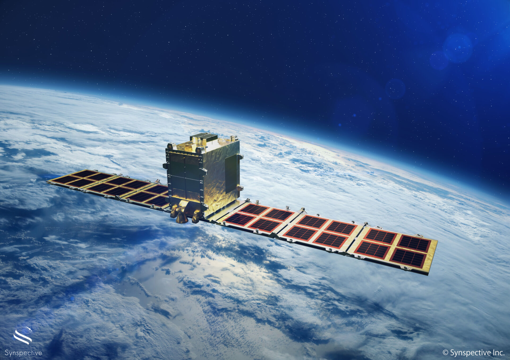
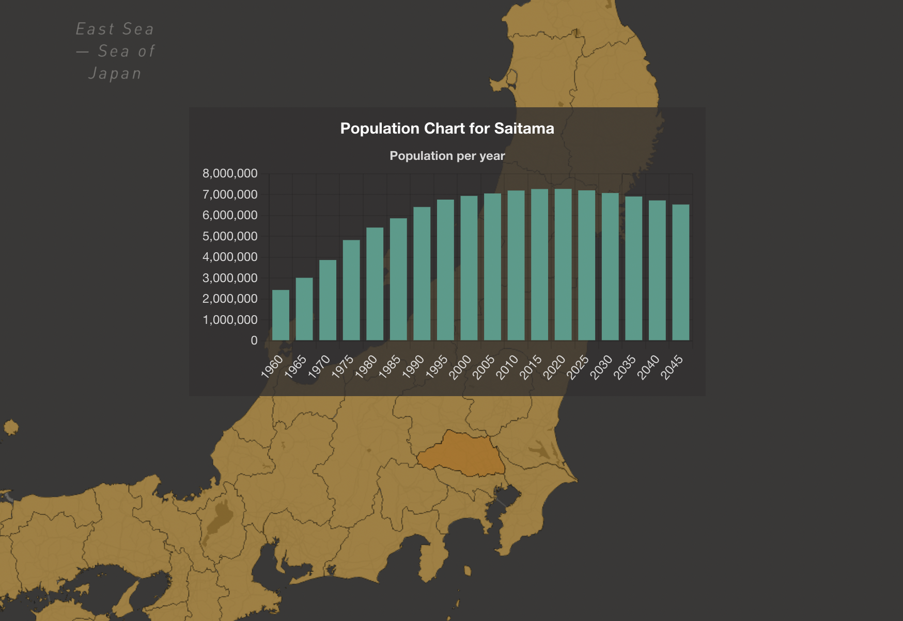

> *“The map is not the territory.”*

A few years ago, I worked at a Japanese space tech startup building and operating small SAR (Synthetic Aperture Radar) satellites. Unlike optical satellites, SAR can capture imagery through clouds and at night, making it useful for monitoring infrastructure, disasters, and environmental change.

As a software engineer, I worked on satellite tasking systems: A user selects an area on a map, requests imagery, and later receives processed satellite data.

That “area on a map” has to become structured data that the backend understands, stores, and ultimately uses to instruct what a satellite captures hundreds of kilometers above Earth.

For that, we used **GeoJSON**.

## What is GeoJSON?

GeoJSON is a standard for representing geographic data structures using JSON. It supports geometries like:

- Points  
- LineStrings  
- Polygons  
- Multi-geometries and FeatureCollections  

A polygon in GeoJSON looks like this:

```json
{
  "type": "Polygon",
  "coordinates": [
    [
      [139.6917, 35.6895],
      [139.7000, 35.6895],
      [139.7000, 35.6950],
      [139.6917, 35.6950],
      [139.6917, 35.6895]
    ]
  ]
}
```

Coordinates are expressed as [longitude, latitude], and polygons must “close”, as in the first and last coordinate must be the same.

So it's JSON at the end of the day. Human-readable, easy to log, easy to send over APIs, and supported by a large ecosystem of tools and libraries.

In a codebase that also dealt with orbital scheduling and radar signal processing, being able to just read the data in a log was a small but genuine relief.

## GeoJSON as a System Boundary

GeoJSON isn’t as complicated as it may seem. The spec ([RFC 7946](https://datatracker.ietf.org/doc/html/rfc7946)) is clear, and as far as validation goes, mature libraries can handle it reliably.

The unique part about GeoJSON was its role in the system. GeoJSON became a boundary object shared across very different domains:
- Frontend UI code rendering interactive maps
- Backend APIs handling user requests
- Spatial databases storing and querying areas of interest
- Scheduling services determining capture feasibility
- Image processing pipelines cropping and analyzing results

Each part of the system had different concerns. The frontend cared about user interaction. The backend cared about persistence and APIs. Scheduling logic cared about geometry relative to satellite ground tracks. Processing pipelines cared about clipping and bounding boxes.

Despite those differences, every component was perfectly happy consuming the same small JSON object with coordinates.

We relied on a standard rather than designing a custom format. It meant less friction between services, straightforward logging, and predictable APIs. Boring perhaps, but sometimes boring is good.

## Spatial Data Is Not CRUD Data

Working with GeoJSON was interesting because the data went beyond what's typical in a CRUD system.

Most of the time, application code deals with simple, discrete things. Queries generally look like:

```
id = ?
created_at > ?
status = 'active'
```

When it comes to spatial data, the focus is not to select and retrieve a record.
An area of interest data is a shape in a coordinate system, so the useful operations involve geometric checks, such as:

- intersects
- contains
- overlaps
- within

Instead of checking whether a record exists, you’re testing and validating whether a geometry intersects the satellite’s projected ground track within a given time window.

This changes how you model and reason about data. Low-level geometric details, like polygon winding order become relevant.

Note: Winding order is whether a polygon's vertices run clockwise or counterclockwise. RFC 7946 requires counterclockwise for exterior rings. If you get it wrong, your polygon over Tokyo gets interpreted as everywhere on Earth except Tokyo, which can result in a very expensive satellite capture.

## From Polygon to Orbit

In a tasking workflow, the flow was roughly:

1. A user draws an area of interest in the browser.
2. The frontend serializes that shape into GeoJSON.
3. The backend validates and stores it.
4. Scheduling logic determines when a satellite can capture that area.
5. The same geometry is reused for cropping, processing, and visualization.

That same polygon could move through:
- A browser map  
- A REST API
- A spatial database
- A scheduling service
- An image processing pipeline
- Eventually, it influenced a real satellite in orbit.

Of all the things to stress about in a satellite company, I spent more time than I’d like to admit thinking about polygon winding order.

## A Small Exploration: japan-geo-graph
After working with geographic data in production systems, I built a small demo project:



https://japan-geo-graph.vercel.app ([github](https://github.com/asawo/japan-geo-graph))

It’s a lightweight exploration of geographic and demographic data. Mostly a learning exercise (which is another way of saying it doesn't do anything useful).

Working in space tech made me curious about how spatial data can be modeled and visualised beyond traditional GIS tools.

The good thing about this is, no satellites are at risk if I get the geometry wrong. But the core idea is the same: geographic data is about more than a set of coordinates. It encodes relationships, adjacency, and structure.

## Closing Thoughts

What I liked about learning to use GeoJSON was that something you could read in a text editor sat at the center of a system operating in outer space.

A humble JSON format turned out to be a key interface in a system connected to actual satellites.

---

## Further Reading
- [GeoJSON Specification (RFC 7946)](https://datatracker.ietf.org/doc/html/rfc7946)
- [geojson.org](https://geojson.org/) 
- [PostGIS Documentation](https://postgis.net/documentation/) 
- [Mapbox GL JS Documentation](https://docs.mapbox.com/mapbox-gl-js/)
- [Leaflet Documentation](https://leafletjs.com/)
- [Synspective](https://synspective.com/) 