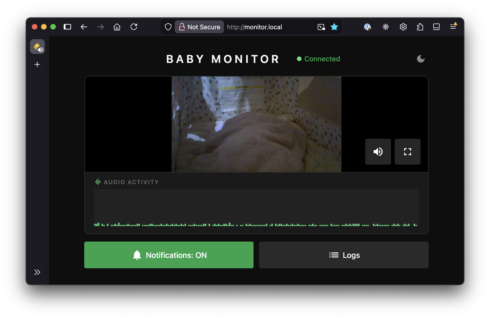
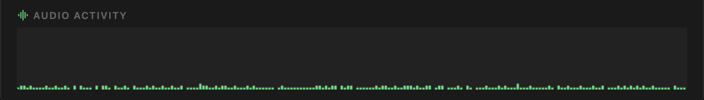

> *”The signal is the truth. The noise is what distracts us from it.”* — Nate Silver

My partner and I have been working on a project for almost a year, and we finally released it.

By which I mean: we became parents.

It's been tough but a rewarding and fun experience. I found myself with some downtime when our baby is sleeping, so I figured I should get a baby monitor so that while they're sleeping, I can do other things while also keeping an eye on the baby.

At first I didn't really understand what I needed, but after some thought, I had a list of requirements:
- Camera with good mounting options
- Detect crying
- Detect pooping 
- Push notifications
- Some kind of audio visualiser 
- Stream accessible via web browser

Unfortunately this kind of thing can get very expensive, especially ones with smart/AI features. We’re talking tens of thousands of yen, and on top of that some charge monthly subscription fees for analytics I don’t need.

I found the available options surprisingly frustrating. As a stingy man, I don't want to pay that much money for a glorified webcam stream. And subscription fees were absolutely out of the question. 

I mean I can make this myself. Probably.

## Time to walk the talk: Planning the build

So what do software engineers do when faced with expensive software and services they don't want to pay for? We hack together an MVP.

I had a spare raspberry pi 4 lying around. I didn't have a webcam so I bought a cheap logicool one on amazon (`Logicool Web Camera C270nd HD 720P`). 

That's pretty much it for the hardware side of things.

## The stack

The end result is four services running on the Pi:

| Service | What it does |
|---|---|
| `stream` | FFmpeg captures webcam audio/video and pushes an RTSP stream |
| `mediamtx` | MediaMTX receives the RTSP stream and re-publishes it via WebRTC |
| `monitor-http` | Go HTTP server serving the web UI and REST API |
| `detect` | Python service that classifies audio and sends push notifications |

Open `http://monitor.local` in a browser and you get live video, a waveform, and the occasional 💩 alert.

The full source is on [GitHub](https://github.com/asawo/baby-monitor) if you want to have a look at it yourself.

I wanted to keep things simple. My first goal was to stream the video and audio from the webcam and make it available within my home wifi network.

## Streaming with HLS (HTTP Live Streaming)
I wanted to stream the video via this html site. Capturing the audio and video was fairly simple using `FFmpeg`. I gave HLS (HTTP Live Streaming) a go, which was as simple as:

```bash
ffmpeg -i /dev/video0 \
  -c:v libx264 -preset veryfast \
  -f hls \
  -hls_time 3 \          # 3-second segments
  -hls_list_size 5 \     # keep last 5 segments
  /var/www/stream.m3u8   # playlist file
```

What this does is:
- Encodes video with H.264 (libx264) using fast encoding
- Splits the stream into 3-second .ts segment files
- Maintains a rolling playlist of the last 5 segments (~15s of buffer)
- Writes a .m3u8 playlist file that media players use to find and play the segments

This worked, kind of. But with ~10 seconds or so of lag.

From what I understood, the player was pre-buffering before starting playback (typically ~3 segments). So with the above command:

```
3s × 3 segments ≈ 9s latency
```

That plus a bit of encoding/network overhead resulted in about 10s lag. 

The obvious solution would be to reduce segment duration and reduce the list size. But even so, it results in 3~5s latency.

I felt that this was fundamentally not the right approach, so I did some research and came to the conclusion that I should use `MediaMTX` instead. 

## Streaming with MediaMTX and WebRTC

The problem is, I don't want HLS due to its inherent buffering latency. I want a real-time protocol with minimal buffering, which is exactly what `WebRTC` is. It's not as simple as HLS, but by installing `MediaMTX`, most of the complexity is abstracted away.

This reduced the latency to less than 1s.

At this point, I had a minimal but already fairly usable setup. The webcam was mountable on many surfaces, and the stream was available on my local network from all my devices that were connected to it via a browser.

## Audio visualizer



The WebRTC stream includes audio, so I figured I'd visualize it too. Using the Web Audio API, I tap into the stream's audio track, route it through an `AnalyserNode`, and sample amplitude at regular intervals. The result is a scrolling bar chart that colour-codes the level into three colours. Green for quiet, yellow for medium, red for loud.

It's mostly useful for confirming the mic is actually picking something up without having to unmute and potentially wake the baby.

## Cry detection

For cry detection I used **YAMNet**, which is a pre-trained audio classification model from Google trained on the AudioSet dataset. It recognizes ~521 audio classes, including "Baby cry, infant cry" at class index 20.

A Python service reads from the same RTSP stream as MediaMTX, using FFmpeg to decode audio to raw 16kHz mono PCM. 

It slices the audio into ~1-second windows (15,600 samples at 16kHz) and feeds each one through the YAMNet TFLite model. If the confidence score for the cry class clears a configurable threshold, it fires a push notification.

For push notifications I used [ntfy.sh](https://ntfy.sh/), which is an open-source notification service. You subscribe to a topic on your phone, and POSTing to that topic URL sends a push. Free, no subscription, no account required. Crying and wet farts (poop) trigger a phone notification; dry farts are flagged in the UI only.

## Fart & Poop detection

It was simpler than I thought to isolate fart noises, but quite difficult to distinguish dry vs wet farts.

I initially thought I could use the same model to cross-classify and associate with other wet sounds like squelching, but it didn't work reliably.

Instead I applied ✨*spectral analysis*✨. Wet farts tend to have higher-frequency energy (>1kHz) while dry farts sit in the low-to-mid range (<500Hz). The classifier looks at the peak high-frequency energy ratio across overlapping frames within each audio window. The reason for using the peak rather than the mean is because a wet event lasting only part of the window would otherwise get diluted by surrounding silence.

It's accurate about 70% of the time. To push that further I'd need to factor in spectral entropy, flux, and waveform kurtosis. In other words, it's basically how messy and variable the waveform is. Wet farts tend to have more pops, spikes, and moment-to-moment variation than dry ones.

Thought you guys should know.

All together, the data flow looks like this:
```
Webcam
  │
  ▼
FFmpeg (RTSP stream)
  │
  ▼
MediaMTX ───► WebRTC → Browser
  │
  ▼
Python detect → ntfy.sh → Phone
```

## Other considerations

One thing that bit me early on was USB device path instability. Paths like `/dev/video0` can change on reboot depending on the order the kernel enumerates USB devices. The fix was a udev rule that matches the webcam by its USB vendor/product ID and creates a stable symlink at `/dev/baby-cam`. With this, the device path never changes regardless of what else is plugged in.

In a similar way, ALSA audio card numbers can change, so instead of addressing the mic by card number I address it by card name (`hw:WEBCAM,0`), which is derived from the USB descriptor and stays consistent.

The FFmpeg stream, MediaMTX, the Go HTTP server, and the Python detection script runs as systemd services on the Pi. The stream service depends on the camera device unit, so systemd waits for the camera to appear before starting and automatically stops the service if it gets unplugged.

## Future plans and features

I'm probably not going to add much more if I'm being honest. The monitor does everything I need it to do. I thought about motion detection and sleep analytics, but I don't need them, and the whole point was to avoid paying for features I don't want.

If I do get bored and add things, the repo is public and I'll update it there. Either way, if you made it all the way down here: congratulations — you are now a certified baby fart signal processing expert. Welcome to the club.

---

## Further Reading
- [mediamtx](https://mediamtx.org/)
- [ntfy.sh](https://ntfy.sh/)
- [YAMNet on TensorFlow Hub](https://www.kaggle.com/models/google/yamnet)