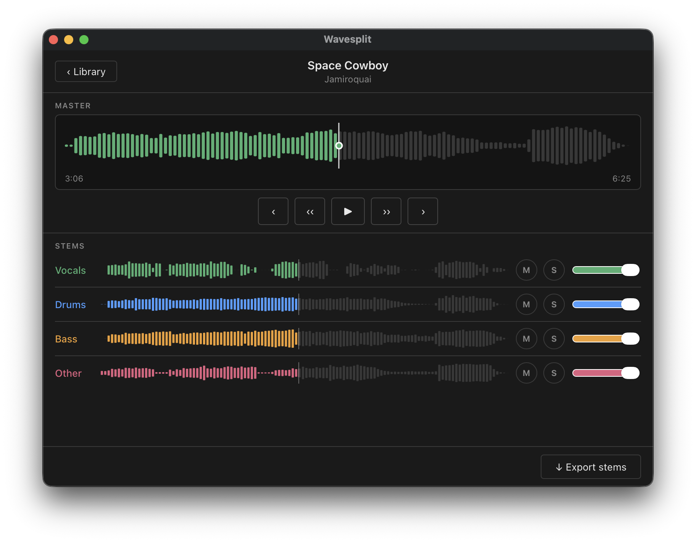

> *”Mastery of music is its own reward.”* — Apollonius au Valii-Rath

I've always enjoyed playing the bass guitar. I spent countless hours listening to songs, playing along to my Jamiroquai albums until the blisters stopped me.

I also spent a good amount of time on youtube to watch bass covers. It was helpful to see how people play certain songs by looking at where they were fretting, which string they were plucking, what rhythm and patterns they were slapping, which neck position their hand were at, etc.

It got me pretty far as a bedroom bassist, and not to toot my horn, but I'm quite proud of my technique, timing, and overall groove I've developed over the years.

But, there was one annoyance when it came to learning songs by ear. A lot of the times, it's difficult to hear the bass. Sometimes the volume is just too low, or the bassline is getting lost in the mix, or there's just too many instruments playing at once to isolate the bass reliably with my own ears.

I spent years wishing there was some way of `isolating the bass track` from the other instruments to understand exactly what was being played.

The year is 2026. I'm a software engineer. This is a problem that can be solved with software. It's time for some coding.

## Requirements
What I ideally want from my app are 3 things:

1. Select a song: a local audio track file or a youtube link to a song
2. Separate the instrument tracks (with option to export)
3. Playback for the separated tracks, with option to solo/mute each track

So there's already apps that can do most of this. [Moises.ai](https://moises.ai/) can do pretty much exactly what I want, plus a whole lot more. The only thing missing here is the ability to feed a song straight from youtube. 

For me, downloading from youtube is a high priority feature, since like most people these days, I use Spotify to stream songs. I no longer have a huge collection of songs on iTunes (something I'm considering going back to, but that's a separate blog post).

The other problem is, most of these services are subscription based. I hate subscriptions.

## How it works under the hood
There are several technical terms for isolating instrument tracks. `Music Source Separation (MSS)`, `Stem Separation`, `Demixing`, etc. 

Most of these use AI models that are trained to identify targets in mixtures. 

The AI is trained on huge collections of real recordings where the isolated parts (drums, bass, vocals, etc.) already exist.

The model learns the patterns, i.e. what a snare drum sounds like, what a bass guitar sounds like, how they tend to overlap in a mix. The model will estimate and produce these separated stems as the output.

Early models were large and required server-grade GPUs to run, so this required the cloud. Fortunately, modern models are much more efficient and consumer hardware is getting pretty good with running AI models, so I can run them on my laptop pretty well.

There are several opensource models available at the time of writing, and [Demucs](https://github.com/adefossez/demucs) seems to have the highest quality of stem separation for my needs. This can split a track to 4 stems: bass, drums, vocals, other. 

There is a 6 stem version available, which produces a guitar and piano stems, however the separation was not working as reliably. 

## The pieces

Going back to the requirements, these are the tools that will do the heavy lifting:
1. Youtube download: [yt-dlp](https://github.com/yt-dlp/yt-dlp)
2. Stem separation: [demucs](https://github.com/adefossez/demucs)

The rest can be hand-rolled. I decided to tackle this in 2 phases. 

First phase is to get the `yt-dlp` --> `demucs` processing working. 
The goal would be to export stems with a youtube url as the input. 

Second phase is the playback feature. For practice purposes, I don't always want to be exporting tracks into a DAW because of the extra effort. I just need a simple interface to control the playback so that I can practice along the drum track of a song, or isolate the bass to try and figure out exactly what was being played.

That being said, One thing to keep in mind here is that I want to use this software to export the stems to a DAW like garageband for recording purposes. For this, I decided a `desktop app` is the way to go. 

## Stack

For a desktop app, there's a bunch of options to pick from. I wanted to cross-compile into MacOS, Windows, and Linux. I wanted to keep it light and quick. Viable options that came to mind were [Electron](https://www.electronjs.org/) and [React native](https://reactnative.dev/). I didn't like the idea of writing JavaScript for the whole app though. I then came across [Tauri](https://v2.tauri.app/). 

> *"Tauri is a framework for building tiny, fast binaries for all major desktop apps"*

Perfect. UI is created with HTML/CSS/JS, and the logic layer is to be written in [Rust](https://rust-lang.org/). I've never written Rust, but it's been on my list of languages to learn, so I figured this was perfect.

The application I'm building will be mostly be orchestrating the following pipeline:

<!-- Insert overall flow of app -->

These are long-running sub-processes, so Rust's tokio async runtime handles these efficiently. I don't need to think about Node's event-loop quirks either. 

The binary size will be samll, and the startup time should be in milliseconds, lighter and faster than Electron.

That being said, important to keep in mind that Rust will not be doing much heavy lifting. Most of the heavy stuff is within the subprocesses which are not Rust - demucs is Python based like most ML tools, and yt-dlp and ffmpeg are commandline tools. Rust will be handling the concurrent subprocess management.

## Implementation
It was much smoother than I anticipated. With a fair bit of help from Claude, I was able to string together the first MVP (first phase) very fast, followed by the playback feature (second phase). There's something cathartic about your vision and plan coming together so quickly. 

A lot of the difficulties I ran into were not related to the application code, but rather how to handle the dependencies when distributing the app. If I bundle everything within the app (especially demucs), the app bundle will be quite large and I didn't like that. The build time would increase and I wanted to keep my CI/CD pipeline modular and lean. 

<!-- Insert my final approach for app distribution. Apple especially was a pain in the arse and I want to include that aspect here -->

## Final product
And here it is. The name is *`Wavesplit`* (though this may change in the future). I've been using this app daily to practice along to many songs. For isolating the bass track to transcribe it, to play along with just the drum track, and record some covers of some of my favourite artists.

Wavesplit is something I initially built only for myself, but I'm glad to say it's also available for anyone who is willing to give this a go, thanks to Tauri's cross-platform compatibility.

Here's the repo for [Wavesplit](https://github.com/asawo/wavesplit). You can go to the releases and download a binary for your system.

## Future plans
At this point, I've implemented all the features I initially wanted.  beat/key/chord detection, which are useful features when jamming along a track. 

---

## Further Reading
- [demucs](https://github.com/adefossez/demucs)
- [yt-dlp](https://github.com/yt-dlp/yt-dlp)
- [wavesplit repo](https://github.com/asawo/wavesplit)