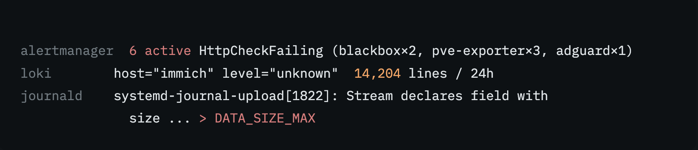

> *“The greatest value of a picture is when it forces us to notice what we never expected to see.”* — John W. Tukey

I've been slowly building out my homelab, which currently consists of a single Proxmox box running six application LXCs and a seventh for monitoring.

There's Immich, AdGuard, Stirling PDF, a couple of file servers, a wiki, and the usual assortment of things that seemed like a good idea to self-host at the time.

The next obvious addition was observability.

I wanted somewhere I could see whether everything was alive, look at resource usage, search logs, and get notified when something broke. So I ended up with the fairly standard Grafana stack:

- Prometheus for metrics
- Loki for logs
- Grafana for dashboards
- Alertmanager for alerts
- Blackbox Exporter for HTTP checks
- Grafana Alloy for collecting logs

Getting everything running was pretty straightforward.

Getting everything to tell me the truth was slightly less straightforward.

Within the first few days I had six alerts telling me perfectly healthy services were down, thousands of logs with an `unknown` log level, and a journald receiver repeatedly crashing.

So I spent considerably more time debugging my monitoring than actually monitoring anything.

Here are the three problems I found most interesting.

## Docker didn't know about my DNS

The first thing I noticed was that my shiny new uptime dashboard looked terrible.

Six `HttpCheckFailing` alerts were firing. Every `*.home` service appeared down, Proxmox metrics were missing, and the AdGuard dashboard wasn't getting any DNS stats.

The services themselves were fine, so that narrowed things down quite a bit.

My homelab uses AdGuard for DNS, including local rewrites like:

```text
photos.home (Immich)
monitoring.home (Grafana)
adguard.home (DNS)
```

The LXC containers themselves use Tailscale's resolver at `100.100.100.100`.

The problem was that the exporters were running one level deeper, inside Docker.

Tailscale's DNS address exists on the LXC host's `tailscale0` interface, but isn't reachable from inside the Docker network namespace. Docker therefore picked another resolver for the containers.

Unfortunately, it picked my LAN gateway.

My LAN gateway had absolutely no idea what `photos.home` (Immich) was.

I checked `/etc/resolv.conf` inside the affected containers and found the same incorrect resolver in all three. What initially looked like several unrelated monitoring problems was really just one DNS problem.

The fix was not particularly exciting. For example, here's the Blackbox Exporter change:

```diff
blackbox-exporter:
  image: prom/blackbox-exporter:v0.25.0
+ dns:
+   - 192.168.11.207
```

I explicitly pointed all three exporters at AdGuard.

On the next scrape, the alerts disappeared.

A useful reminder that when several unrelated things suddenly break in exactly the same way, they're probably not unrelated.

## Why are all my logs `unknown`?

With uptime working, I moved on to logs.

Immich is a NestJS application, and its logs conveniently contain the log level:

```text
[Nest] LOG [InstanceLoader] Immich dependencies initialized
```

So extracting `LOG`, `WARN`, `ERROR`, etc. should have been easy.

Except Grafana showed most of my logs as:

```text
level="unknown"
```

Looking at what Loki had actually stored made the problem fairly obvious:

```text
\x1b[36m[Nest]\x1b[39m \x1b[32mLOG\x1b[39m [InstanceLoader] ...
```

Colours!

NestJS was outputting ANSI colour escape sequences, and those bytes were being shipped all the way into Loki.

I already had an Alloy `stage.replace` configured to remove them, and according to [the Alloy documentation](https://grafana.com/docs/alloy/latest/reference/components/loki/loki.process/#stagereplace) it should have been operating on the log line by default.

Apparently it wasn't.

Rather than continue tweaking the regex, I tried something much simpler.

I changed the stage to replace:

```text
Nest → TESTMARKER
```

Then searched Loki for `TESTMARKER`.

Nothing.

Meanwhile `Nest` continued happily arriving unchanged.

That was useful because it ruled out my ANSI regex entirely. The replacement stage simply wasn't modifying the forwarded log line the way I expected it to.

Fortunately Alloy has [`stage.decolorize`](https://grafana.com/docs/alloy/latest/reference/components/loki/loki.process/#stagedecolorize) specifically for this:

```diff
- stage.replace {
-   expression = "\\x1b\\[[0-9;]*m"
-   replace    = ""
- }
+ stage.decolorize {}
```

After switching to `stage.decolorize`, the stored line became:

```text
[Nest] LOG [InstanceLoader] Immich dependencies initialized
```

and the level extraction started working.

This was probably my favourite bug of the three because the useful debugging technique was incredibly unsophisticated.

When you're not sure whether a transformation is happening, replace something obvious with something stupid and see if it appears.

`TESTMARKER` has never let me down.

## My elegant journald setup lasted about five minutes

The last problem came from the few LXCs where I don't run Docker.

Copyparty, FileBrowser, and LeafWiki are just native services writing to journald.

I didn't particularly want to install another daemon everywhere just to ship logs, and systemd already provides [`systemd-journal-remote`](https://www.man7.org/linux/man-pages/man8/systemd-journal-remote.8.html) and [`systemd-journal-upload`](https://www.man7.org/linux/man-pages/man8/systemd-journal-upload.8.html).

Perfect.

One central receiver, tiny footprint, nothing else to maintain.

Then I turned it on.

```text
systemd-journal-remote: Stream declares field with
size [large value omitted] > DATA_SIZE_MAX
```

The receiver immediately started crash-looping.

After digging through the package versions and upstream issues, I eventually traced it to how `systemd-journal-remote` handled chunked request bodies delivered by `libmicrohttpd`. The receiver treated each fragment as a complete compressed blob, rather than processing the request body incrementally ([systemd issue #43614](https://github.com/systemd/systemd/issues/43614)).

More importantly, it affected the package combination Debian trixie currently ships:

```text
systemd 257.13
libmicrohttpd12t64 1.0.1-4
```

At this point I had a few options.

I could pull a newer `libmicrohttpd` from sid, but I couldn't find any evidence that the bug was fixed there.

Or I could downgrade to the bookworm version, override the declared dependencies, and bring an older `libgnutls30` along for the ride.

This was quickly becoming a lot of effort to preserve an architecture I'd chosen because it was supposed to be simple.

So I gave up. Each LXC now runs Grafana Alloy directly as a small standalone binary and systemd service. Alloy reads the local journal and ships it straight to Loki.

```text
LXC
├── application
├── journald
└── Alloy
      │
      └──► Loki
```

It's technically more software running on each container than my original design, but it's also much less weird.

I kept one rule from the original setup: nothing gets installed directly on the Proxmox host. The hypervisor stays clean and boring.

Interestingly, changing the architecture also uncovered a couple of smaller configuration problems that hadn't been exercised yet. Loki needed [`compactor.delete_request_store`](https://grafana.com/docs/loki/latest/configure/#compactor) configured when retention was enabled, and I'd completely forgotten to add a DNS rewrite for `monitoring.home`.

So fixing one problem revealed two more.

Very observability.

## What I ended up with

After about six days of messing around, everything now looks roughly like this:

```text
HTTP targets ──► Blackbox Exporter ─┐
PVE metrics ────────────────────────┼──► Prometheus ─┐
AdGuard metrics ────────────────────┘                │
                                                     ├──► Grafana
LXC journald ──┐                                     │
               ├──► Alloy ──► Loki ──────────────────┘
Docker logs ───┘

Prometheus ──► Alertmanager
```

Nothing here is particularly fancy. Most of the problems were small configuration or integration issues that happened to sit across Docker, DNS, systemd, Debian packages and Grafana's tooling.

But that's also what I've been enjoying about running a homelab.

At work, these layers might belong to several different teams. At home, if DNS is broken, congratulations: you're the DNS team.

The most useful habit throughout all of this was just checking one layer lower than wherever the problem appeared.

Grafana says the service is down? Check whether the exporter can actually resolve it.

The regex doesn't match? Look at the bytes Loki actually stored.

The systemd service keeps crashing? Check the packages underneath it.

None of that is particularly clever, but it saved me from spending a lot of time fixing the wrong thing.

And, more importantly, my monitoring system has finally stopped generating incidents for itself.
